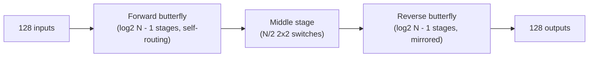
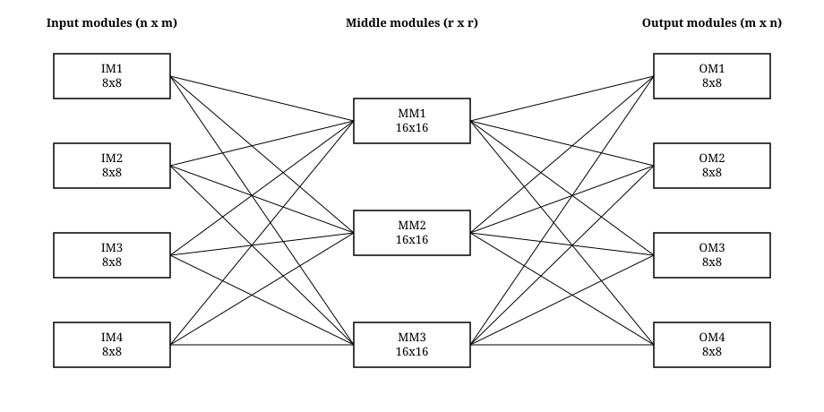
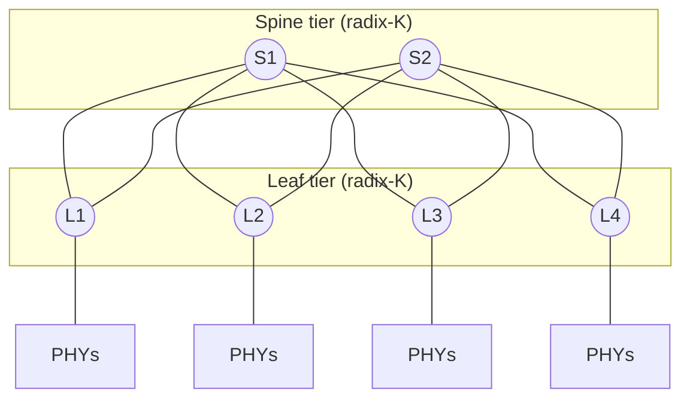
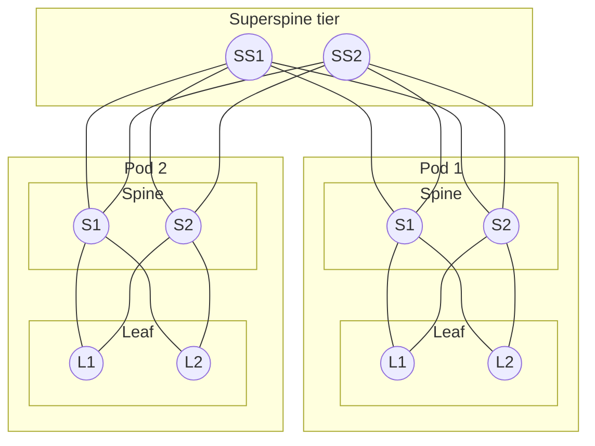

# Crossbar Fabric Architecture Spec

Study/reference doc for an arbitrated Ethernet crossbar fabric project (interview prep for
high-radix switch-silicon roles). Covers the candidate interconnection topologies, evaluates
each one against the project's actual constraints (size, clock frequency, blocking), documents
the resulting topology decision, how the design scales to thousands of ports, and the
resulting design parameters.

Ports are treated as Ethernet PHY/MAC terminations: each ingress MAC receives Ethernet frames,
segments them into fixed-size cells, and hands them to the fabric; each egress MAC reassembles
cells back into frames. Any of the N ports can talk to any other — the fabric doesn't know or
care about frame contents, only cell headers (`{src, dst, seq}`).

---

## 1. Problem statement and design constraints

Build an input-queued switch fabric that:

1. Avoids head-of-line (HOL) blocking (VOQ).
2. Schedules input-output matches fairly and starvation-free (iSLIP).
3. Is **minimally sized** — fewest crosspoints/switching elements for the guarantee it provides.
4. Runs the switching decision and datapath transit at a **2 GHz clock** (500 ps cycle budget).
   This is a real constraint on the *scheduling algorithm's* structure, not just the datapath:
   an algorithm that needs a global search or a long fixed pipeline before a cell can move is
   disqualified regardless of how few crosspoints it uses.
5. Is **minimally blocking, with non-blocking as the ideal** — but not at unbounded cost. The
   goal is the best point on the size/speed/blocking trade-off, not blocking-probability zero
   at any price.
6. Is parameterizable in port count (N), per-tile crossbar radix (K), and Clos tier count (T)
   — so growing the design is a re-parameterization, not a redesign.

The topology choice (how ports are physically interconnected) and the scheduling algorithm
(how contention is resolved each cell time) are separate decisions that interact — a topology
can be small on paper and still fail constraint 4 if its scheduling algorithm can't run fast
enough to use it. This doc weighs both together, not topology size in isolation.

---

## 2. Candidate topologies

All crosspoint counts below use one consistent unit: a monolithic k×k crossbar module
contributes k² crosspoints, and a 2×2 switch element (the atomic building block of butterfly,
Beneš, and Batcher networks) is itself a 2×2 crossbar, so it contributes exactly 4 crosspoints.
This lets every topology's cost be compared on the same basis.

### 2.1 Monolithic crossbar

A single N×N array of crosspoints; every input has a direct physical path to every output.

```
              O0   O1   O2   O3   O4   O5
        I0  [ ●    ●    ●    ●    ●    ● ]
        I1  [ ●    ●    ●    ●    ●    ● ]
        I2  [ ●    ●    ●    ●    ●    ● ]
        I3  [ ●    ●    ●    ●    ●    ● ]
        I4  [ ●    ●    ●    ●    ●    ● ]
        I5  [ ●    ●    ●    ●    ●    ● ]
```
*Shown at N=6 for legibility. Every ● is a dedicated crosspoint. At N=128 this grid is
128×128 = 16,384 crosspoints.*

- **Blocking**: none internally — trivially, perfectly non-blocking.
- **Cost**: **16,384 crosspoints** at N=128 — largest of every option considered.
- **2 GHz fitness**: the datapath (a mux tree) is fast, but the *scheduling* decision is not —
  a single centralized arbiter must resolve contention across all 128 requesters at every
  output, with iSLIP needing up to log₂(128)=7 sequential request/grant/accept iterations to
  converge each cell time. That's a single large, non-parallelizable arbitration domain whose
  critical path grows with N — the opposite of what a 2 GHz, high-radix design wants.
- **Why it's disqualified**: fails constraint 3 outright (worst size by a wide margin) and
  constraint 4 non-trivially (arbitration doesn't parallelize). Kept only as the Milestone 1/2
  reference design to validate VOQ + iSLIP correctness before adding topology complexity.

### 2.2 Butterfly / Banyan network

log₂N stages of 2×2 self-routing switch elements. Stage k routes on bit k of the destination
address.


*N=8 example (3 stages), drawn in the standard textbook form (Leighton; Dally & Towles): a
column of wire positions 0–7 per level, with a straight edge and a crossing edge between every
partner pair at each level — level k pairs positions differing in bit k, so the crossings get
coarser (jump by 4) on the left and finer (jump by 1) on the right. There is exactly one path
between any given input and output — that single-path property is exactly what makes the
network self-routing, and exactly what makes it internally blocking under arbitrary traffic.*

- **Cost**: 7 stages × 64 SEs/stage = 448 SEs × 4 crosspoints/SE = **1,792 crosspoints** —
  cheapest option considered, by a wide margin.
- **Blocking**: general traffic needs either a **Batcher sorting network** in front
  (§2.5) or per-stage buffering with backpressure, accepting statistical (not guaranteed)
  throughput.
- **Where VCs fit in**: virtual channels improve queueing efficiency on the one path that
  exists (less HOL blocking at the flow-control layer, no deadlock) but **do not add path
  diversity**. Two flows forced onto the same physical link by an adversarial permutation still
  contend for that link's bandwidth — VCs let them interleave fairly, they don't create a
  second wire. VCs fix the *average case* on a blocking topology; they don't turn it into a
  non-blocking one.
- **Why it's disqualified on its own**: fails constraint 5 directly — no non-blocking guarantee,
  statistical only. Cheapest option is irrelevant if it doesn't meet the blocking requirement;
  included here because it's the building block both Beneš and Batcher-Banyan are built from.

### 2.3 Beneš network

Two butterfly/banyan networks placed back-to-back around a shared middle stage — equivalently,
the fully recursive special case of a 3-stage Clos where every module is 2×2
(2·log₂N − 1 stages total).


*Block view at N=128: 13 total stages (2·log₂128 − 1). Structurally this is "give the
butterfly real path diversity" — a second physical pass through switching stages, related to
Valiant load-balancing (disperse to a random midpoint, then route to the true destination).*

- **Cost**: 13 stages × 64 SEs/stage = 832 SEs × 4 crosspoints/SE = **3,328 crosspoints** —
  the **smallest genuinely non-blocking-capable option** of every candidate here, cheaper than
  either Clos variant.
- **Blocking**: rearrangeably non-blocking — any permutation *can* be routed without internal
  contention.
- **Why it's disqualified despite winning on size**: finding the collision-free assignment
  across all 13 stages for a given permutation is a **global** routing/edge-coloring problem
  (e.g. the classical looping algorithm), not a local, per-cell-time-computable decision. There
  is no known way to compute this in a small, fixed number of cycles using simple parallel
  logic the way distributed matching can — it fails constraint 4 outright, not on cost grounds.
  If port assignments changed rarely (circuit switching, where the computation can run once and
  persist), this would be the strongest candidate on the table. For a fabric re-matching every
  single cell time, the global computation is the disqualifying factor.

### 2.4 Batcher-Banyan network

A **Batcher bitonic sorting network** (log₂N·(log₂N+1)/2 stages of compare-exchange elements)
feeding a banyan network (§2.2). If the N cells presented to the banyan stage are sorted into
monotonic destination order and represent a conflict-free assignment (at most one cell per
output — which upstream VOQ + iSLIP already guarantees, since a valid iSLIP match is exactly
that), the classical Batcher-Banyan theorem guarantees the banyan stage routes all of them
without internal collision, using a fixed feed-forward pipeline and no runtime search at all.
This was the basis of several real ATM switch fabrics in the 1980s–90s (e.g. the Bellcore
Starlite/Sunshine designs).

- **Cost**: Batcher stage — log₂(128)·(log₂(128)+1)/2 = 28 stages × 64 comparators/stage =
  1,792 comparators × 4 crosspoints/comparator = 7,168 crosspoints. Plus the banyan stage's
  1,792 crosspoints (§2.2). **Total: 8,960 crosspoints.**
  This is the correction worth flagging explicitly: Batcher-Banyan has a reputation as the
  "cheap" non-blocking option because its raw *element* count (1,792 comparators + 448 SEs =
  2,240) looks small next to Clos's 4,096 *crosspoints* — but comparing raw element counts to
  crosspoint counts isn't apples-to-apples. Once every element is priced in the same
  crosspoint-equivalent unit, Batcher-Banyan is actually the **second-largest** non-blocking
  candidate here, beaten only by the monolithic crossbar.
- **2 GHz fitness**: no per-slot global computation is needed (a genuine advantage over Beneš)
  — but the sort network sits directly in the cell's data path with 28 sequential stages before
  the banyan's 7, for 35 total stages. Even fully pipelined at one stage per cycle, that's 35
  cycles of fixed latency at 2 GHz (17.5 ns) before a cell exits the fabric, and 35 stages of
  pipeline registers is a real additional area cost the crosspoint count above doesn't capture.
- **Why it's disqualified**: loses on size once correctly counted, and its stage count scales
  as O(log²N) — worse than Clos's tiered O(log N / log K) growth (§5) as port count increases
  toward "thousands." Doesn't fail constraint 4 the way Beneš does, but doesn't win on
  constraints 3 or 4 either, so there's no criterion left for it to win on.

### 2.5 Clos network (selected)

Three stages of smaller crossbar modules: r input modules (n×m), m middle modules (r×r),
r output modules (m×n).



*Drawn in the classical "bowtie" form (Clos, 1953): input modules on the left, middle modules
in the center, output modules on the right, full bipartite connectivity between adjacent
stages. Shown with 4 input/output modules and 3 middle modules for legibility (full bipartite
connectivity both sides — that bipartite fan-out is the "path diversity" itself). The actual
N=128 design uses 16 input modules (8×8), 8 middle modules (16×16), 16 output modules (8×8) —
same pattern, larger.*

- **Cost** (n=8, r=16):
  - Rearrangeable (m=n=8): 16×(8×8) + 8×(16×16) + 16×(8×8) = **4,096 crosspoints**.
  - Strict-sense (m=2n−1=15): 16×(8×15) + 15×(16×16) + 16×(15×8) = **7,680 crosspoints**.
- **Blocking**:
  - **Rearrangeably non-blocking** (m≥n): any permutation *can* be realized, but a naive
    per-tile greedy matching can fail to find the assignment even though one exists — this is
    exactly the gap Concurrent Round-Robin Dispatching (CRRD) and its refinements close,
    extending iSLIP's request/grant/accept with a middle-module "path hunting" round computed
    via small, local, parallel round-robin arbiters. In practice this converges to near-100%
    throughput within a small, fixed number of iterations — well short of a mathematical
    100%-every-slot guarantee, but strong enough that this is the standard real-world choice
    for exactly this trade-off.
  - **Strictly non-blocking** (m≥2n−1): a new connection is always admittable without
    disturbing existing ones, with no search required — the harder, more expensive guarantee.

  > **CRRD, defined.** Concurrent Round-Robin Dispatching extends iSLIP's request/grant/accept
  > from a single-stage crossbar to a 3-stage Clos by adding a second matching dimension —
  > not just "which output," but "which middle module to route through." Per cell time, over
  > a few iterations: (1) **Request** — each Input Module's non-empty VOQs (one per destination
  > Output Module) compete internally, round-robin, for the IM's m outbound links (one per
  > middle module) — an IM can only issue as many requests per iteration as it has physical
  > links to the middle stage; (2) **Grant** — each Center/Middle Module, seeing requests from
  > multiple IMs for its link, grants via its own round-robin pointer, exactly like iSLIP's
  > per-output arbiter; (3) **Accept** — the receiving side resolves which granted middle-module
  > offer to actually accept, again round-robin. All pointers desynchronize the same way
  > iSLIP's do (advance only on a successful match), and a handful of iterations converges close
  > to a maximal matching for this input–middle–output problem. This is precisely what a naive
  > per-tile iSLIP lacks: no way to discover an *alternate* middle module when the first-choice
  > one is contended — CRRD's added grant/accept round at the middle stage supplies exactly that,
  > using the same small, local, parallel arbiter primitives that make iSLIP itself
  > 2 GHz-schedulable in the first place. Originally from Oki, Rojas-Cessa, and Chao's work on
  > multi-stage Clos-network switch scheduling (early-2000s); later refinements (e.g.
  > Concurrent Master-Slave Round Robin) address residual throughput/fairness gaps in the base
  > scheme.

- **2 GHz fitness — the deciding factor.** Unlike the monolithic crossbar's single N-wide
  arbitration domain, Clos's matching decomposes into many small, parallel, local arbitration
  problems (radix n=8 or r=16, not N=128): each arbiter's priority-encoder depth is bounded by
  log₂(16)=4, not log₂(128)=7, and up to 16 or 8 of them run *simultaneously* across tiles.
  This is the only one of the five candidates whose scheduling decision is both (a) computable
  in a small, fixed number of cycles and (b) gets *cheaper* per-tile as N grows, rather than
  more expensive — which is exactly what a 2 GHz, high-radix design needs. Beneš needs a global
  computation; Batcher-Banyan needs a long fixed pipeline; the monolithic crossbar needs one
  large non-parallelizable arbiter. Clos is the only structure here where "fast scheduling" and
  "large N" aren't in tension.

---

## 3. Comparison table

| | Monolithic | Butterfly | Beneš | Batcher-Banyan | Clos, rearr. | Clos, strict |
|---|---|---|---|---|---|---|
| Crosspoints @ N=128 | 16,384 | 1,792 | 3,328 | 8,960 | 4,096 | 7,680 |
| Non-blocking? | Yes, trivially | No (statistical only) | Yes, rearrangeable | Yes, if input is conflict-free | Yes, near-100% via CRRD | Yes, always |
| Scheduling per cell time | 1 large centralized arbiter (O(N) radix) | Local, but no guarantee | **Global** edge-coloring (not real-time) | None (fixed pipeline) — but 35-stage latency | Small local arbiters, parallel (O(n) or O(r) radix) | Small local arbiters, parallel |
| 2 GHz real-time schedulable? | Marginal — one big arbiter | Yes, but no guarantee | **No** | Yes, at the cost of pipeline depth | **Yes** | Yes |
| Scales to thousands of ports (§5) | No (O(N²)) | Yes | Yes | Worse — O(log²N) stages | Yes — tiered, O(log N / log K) | Yes — tiered |
| Meets all 3 constraints (size, 2 GHz, blocking)? | No — fails size, marginal on speed | No — fails blocking | No — fails speed | No — loses on size once correctly counted | **Yes** | Yes, at ~1.9x the crosspoint cost |

---

## 4. Decision: Clos, rearrangeable (m=n)

Every candidate above was disqualified by a specific, stated constraint, not by preference:

- **Monolithic crossbar** — fails constraint 3 (worst size, 16,384 crosspoints) and is marginal
  on constraint 4 (one large, non-parallelizable arbitration domain).
- **Plain butterfly** — fails constraint 5 outright (no non-blocking guarantee, statistical
  only); virtual channels improve the average case but don't add path diversity.
- **Beneš network** — wins on size (3,328 crosspoints, smallest non-blocking-capable option)
  but fails constraint 4: its non-blocking guarantee requires a global routing/edge-coloring
  computation per permutation, which has no known small-fixed-cycle-count implementation. Right
  answer for circuit switching (where the computation can run once and persist); wrong answer
  for a fabric re-matching every cell time.
- **Batcher-Banyan** — doesn't fail any single constraint outright, but wins on none of them
  either once crosspoints are counted consistently (8,960 — second-largest option, worse than
  strict-sense Clos) and its 35-stage fixed pipeline is a real latency and register cost.

**Clos with rearrangeable non-blocking (m=n=8) is the only candidate that is simultaneously**
**small (4,096 crosspoints — 4x cheaper than monolithic, and cheaper than every genuinely**
**non-blocking-capable alternative except Beneš), 2 GHz-schedulable (matching decomposes into**
**small, parallel, local arbitration — the only structure here where speed doesn't get worse**
**as N grows), and non-blocking in the practical, strong sense that CRRD-style scheduling**
**achieves in real hardware.** It is not the smallest option (Beneš is smaller) and it is not
the strongest non-blocking guarantee (strict-sense Clos and the monolithic crossbar are
stronger) — it is the best point on all three axes simultaneously, which is what the project
constraints actually asked for.

**Strict-sense Clos (m=2n−1=15, 7,680 crosspoints) is the documented escalation path** if a
hard, always-non-blocking guarantee is later required regardless of cost — it keeps the same
2 GHz-friendly distributed scheduling structure, just with enough middle-module slack that no
search or CRRD-style iteration is needed to find a valid assignment. Multi-stage Clos +
distributed iSLIP-family scheduling (CRRD and its refinements) is also the dominant answer
across real high-radix Ethernet switch ASICs for exactly this three-way trade-off — not a
company-specific choice, a well-established one.

---

## 5. Scaling to thousands of ports: do we need more Clos stages?

**Yes, eventually — and the crossover point is a formula, not a guess.**

A 3-stage Clos is limited by the radix it can build its *middle*-stage modules at. If you keep
edge-module size small and let N grow, the middle-stage radix r = N/n grows right along with
it — and once r exceeds the largest crossbar you can actually build as one tile (call that
ceiling **K**, set by area/pinout/wiring and, concretely for this project, by how many
iSLIP/CRRD iterations you can fit in a cell time at 2 GHz), the middle stage itself becomes
infeasible as a monolithic crossbar. The fix is the same trick recursively applied: decompose
the middle stage into its own 3-stage Clos, turning a 3-stage network into a **5-stage** one.
This is exactly how real data-center fabrics scale — a 2-tier leaf-spine network *is* the
folded view of a 3-stage Clos; a 3-tier leaf-spine-superspine network *is* the folded view of a
5-stage Clos.


*2-tier / folded 3-stage Clos — this is the current N=128-radix design, scaled out across
multiple switch tiles instead of built as one.*


*3-tier / folded 5-stage Clos — needed once port count outgrows what a single middle-stage
tile radix can support.*

### The math

For h tiers of radix-K switches (symmetric, half-ports-up/half-ports-down at every
non-terminal tier), maximum supportable ports:

**N_max = 2 × (K/2)^h**

| Tiers (h) | Unfolded Clos stages | N_max at K=64 | N_max at K=128 |
|---|---|---|---|
| 2 (leaf-spine) | 3-stage | 2,048 | **8,192** |
| 3 (leaf-spine-superspine) | 5-stage | 65,536 | 524,288 |
| 4 | 7-stage | 2,097,152 | 33,554,432 |

Using **K=128** — this project's tile radix, empirically the thing Milestone 2 is supposed to
characterize (max feasible N before iSLIP's log₂N-iteration timing budget breaks down at
2 GHz) — a plain **3-stage Clos already reaches 8,192 ports** without adding a tier. "Many
thousands" of ports (low thousands up to ~8K) is covered by the existing design. Only past ~8K
ports would a third tier (5-stage Clos, decomposing the former 128×128 middle-stage crossbars
into their own sub-Clos networks) become necessary.

This is also the general mechanism behind why real switch vendors treat per-chip radix as a
headline metric: doubling native per-tile radix K roughly *quadruples* the reach of a given
tier count (N_max ∝ K^h), which directly reduces hop count (latency, jitter) for a fixed
cluster size. It's also why Batcher-Banyan (§2.4) scales worse here — its stage count grows as
O(log²N) directly, with no equivalent "increase K, keep tiers low" knob the way tiered Clos has.

**Cost of adding a tier**, to be explicit about the trade-off: each additional tier adds a hop
(more latency, more jitter) and requires a deeper nested scheduling extension (a 5-stage Clos
needs CRRD-style matching with *two* levels of "which module" selection, not one). Tiers should
be added only when the N_max formula says the current tier count can't reach the target port
count — not preemptively.

---

## 6. Resulting design parameters

- **N** — total port count (Ethernet PHYs), the top-level parameter.
- **K** — max feasible single-tile crossbar radix, determined empirically in Milestone 2
  (bounded by iSLIP/CRRD's iteration timing budget at 2 GHz).
- **T** — Clos tier count, chosen from the N_max = 2×(K/2)^T formula in §5 for the target N.
- **S** — CIOQ internal fabric speedup over external line rate (§7), target 2.0. Jointly
  constrained with cell size via the 448G/2 GHz cycle-budget math in §7, not decided from the
  HOL-fairness cell-size argument (§2.2) alone.
- Cell size: fixed, e.g. 64B (TBD — decide alongside VOQ depth sizing and jointly with S, §7).
- Milestone 1: 8×8 monolithic crossbar, VOQ + iSLIP, reference/golden-model validated.
- Milestone 2: scale reference design to N=128 monolithic; characterize O(N) arbiter cost,
  iterations-vs-throughput curve, and the practical K ceiling for a single tile at 2 GHz.
- Milestone 3: 3-stage Clos at N=128 (T=2 tiers, n=8, r=16, m=8 → 4,096 crosspoints,
  rearrangeable), CRRD-style scheduling extension of the Milestone 1/2 `rr_pointer` primitive.
- Milestone 3+: CIOQ with speedup S=2 (§7) — an efficiency refinement on top of an already-
  correct design, not a Milestone 1 prerequisite. Validate the cell-size/speedup cycle-budget
  math against real synthesis and STA once RTL exists (OpenSTA/ASAP7 toolchain, project README).
- Stretch: generalize the Milestone 3 Clos generator to be recursive in T (parameterized tier
  count) and to support switching m from 8 to 15 (rearrangeable → strict-sense) as a build-time
  parameter, so scaling from 128 to thousands of ports or upgrading the blocking guarantee is a
  re-parameterization rather than a redesign.

---

## 7. Closing iSLIP's efficiency gap: CIOQ with speedup

iSLIP is a heuristic, not the optimal scheduler. The actually-optimal algorithm (Tassiulas &
Ephremides' MaxWeight matching — pick the maximum-weight bipartite matching every slot,
weighted by queue length or cell age) provably achieves 100% throughput for *any* admissible
traffic pattern, not just well-behaved ones. It's also an O(N³) computation (Hungarian
algorithm) — completely irrelevant for a 2 GHz, high-radix hardware scheduler, so it's excluded
here as a hardware candidate entirely (it remains useful only as a Python-only offline ceiling,
never as an RTL target). The real question is what closes iSLIP's gap toward that ceiling
*without* abandoning the small-parallel-local-arbiter structure that makes it 2 GHz-schedulable
in the first place (§4).

### Why iSLIP alone leaves throughput on the table

Model results (`model/`, hotspot traffic, N=128, load=0.9, single hotspot port at 70% of
traffic) surfaced this concretely: `conditional_throughput_mean` — throughput measured only
over destinations that actually had a cell to send, i.e. excluding idle time — was **0.7427**,
not 1.0, even though the aggregate result matched the theoretical best-case almost exactly
(§ the model's own README). The mechanism: an input holding cells for both the saturated
hotspot and a lightly-loaded destination can have its accept-phase round-robin pick the hotspot
grant in a given slot, silently dropping an otherwise-uncontested grant for the cold
destination that slot. This is the textbook "maximal, not maximum, matching" property of
iSLIP — a real, structural consequence of using a fast heuristic, not a bug.

### CIOQ + speedup: the standard fix

Chuang, Goel, McKeown, and Prabhakar (*Matching Output Queueing with a Combined Input/Output-
Queued Switch*, 1999) proved that a **combined input/output-queued (CIOQ)** switch — VOQs at
the input as already planned, plus a small amount of buffering at the output, with the internal
fabric running at speedup **S ≥ 2** relative to the external line rate — can exactly emulate an
ideal output-queued switch's throughput and delay, using *any* reasonable matching algorithm,
iSLIP included. Instead of inventing a smarter (slower, more complex) scheduler, you give the
existing simple one more chances per external cell-time to find a match: internal fabric
bandwidth is usually cheap relative to external I/O, so this is a favorable trade.

**Measured, not asserted** — the same hotspot config swept over speedup:

| Speedup S | `conditional_throughput_mean` | `aggregate_throughput` | `cell_latency_mean` |
|---|---|---|---|
| 1.0 | 0.7427 | 0.2807 | 295.4 |
| 1.5 | 0.9527 | 0.2808 | 289.7 |
| 2.0 | 0.9931 | 0.2808 | 289.0 |
| 4.0 | 1.0000 | 0.2808 | 288.9 |

Two things worth being precise about, both visible directly in this table:

1. **Speedup cannot raise the aggregate throughput ceiling** — `aggregate_throughput` is flat
   across every S. That ceiling is set purely by offered rate vs. the 1-cell/slot external line
   cap (`theoretical.py`, independent of scheduling entirely); speedup only helps the scheduler
   get closer to a ceiling that already existed. `conditional_throughput_mean`, measured at the
   external line, is exactly the right metric to watch, and it converges to 1.0 by S=4 here.
2. **S=2 already recovers ~99%** of the achievable gap in this measurement — consistent with
   the literature's headline result that S=2 suffices in the general case. Diminishing returns
   past that are visible directly (S=2 → 4 gains 0.007, not another 0.25).

### VOQ already is CIOQ's input side — no separate buffer needed

Worth being explicit about, since it's easy to imagine as a third, distinct buffer: "CIOQ"
decomposes into Input-Queueing + Output-Queueing + speedup, and VOQ (organized per destination,
to avoid HOL blocking, §1) *is* the standard input-queueing structure every real CIOQ design
uses — including Chuang/Goel/McKeown/Prabhakar's own paper above. Adding CIOQ to this design
means adding an output buffer; the VOQ already sitting at the input is unchanged and unaffected.
The model's own code confirms this directly — `fabric.py` has exactly two buffer structures,
`voq` (present since Milestone 1) and `output_queue` (the only thing CIOQ added).

This carries forward to Milestone 3's multi-stage Clos, where it becomes a real design
decision rather than a triviality: does buffering need to exist *between* the three internal
hops (input module → middle module → output module) too, or do the same two buffers (VOQ at
the true input, one output queue at the true output) still suffice across all three stages?
The clean answer — and the one consistent with how CRRD is normally described — is that no
intermediate buffering is needed, **provided CRRD reserves the entire 3-hop path atomically
within a single cell-time**: a cell either gets a fully-reserved input→middle→output path this
cell-time, or it stays in VOQ and retries next cell-time. Milestone 3 should preserve this
property explicitly (whole-path reservation, not partial/staged reservation) rather than
introduce per-hop buffering as a workaround if scheduling gets complicated — that would be a
materially different (and more expensive) design than what §2.5 and §4 assume.

### The real hardware cost — this is not free

Speedup means the **internal fabric bandwidth and the arbitration issue rate** must both run at
S× the external line rate, not just the datapath wiring. Concretely, at S internal iSLIP
matching rounds per external cell-time, the arbiter must be able to *issue* a new matching
decision S times as often — this is where "assume a 448G Ethernet PHY" turns into a real
timing-closure number rather than an abstract parameter.

At 448 Gbps per port and a 2 GHz internal clock, the **external cell-time budget** shrinks fast
as cell size shrinks:

| Cell size | External cell-time | Clock cycles available @ 2 GHz |
|---|---|---|
| 64 B | 1.143 ns | **2.29** |
| 128 B | 2.286 ns | 4.57 |
| 256 B | 4.571 ns | 9.14 |
| 512 B | 9.143 ns | 18.29 |

At 64B cells and S=1, a full iSLIP decision (request/grant/accept, several iterations) must be
*issued* within ~2.3 clock cycles — not resolved, issued, since a properly pipelined arbiter
decouples decision **latency** (how many cycles a given match takes to fully resolve) from
decision **issue throughput** (how often a new one can be started). Pipelining is the standard,
well-understood answer here — not exotic, just mandatory at these numbers, and worth stating
explicitly as a hard requirement rather than an implementation detail to figure out later.
Adding speedup S on top tightens the **issue interval** further, to roughly (cell-time / S):
at 64B cells and S=2, that's ~1.14 cycles between successive decision-issues. This is a
throughput (issue-rate) requirement on the pipeline, not a latency requirement on any single
decision — achievable via deeper pipelining and/or a wider internal datapath (processing
multiple words per issue slot, amortizing the issue-rate pressure back down) — but it is a real
design constraint, not a free parameter, and it compounds directly with the cell-size choice.

This is exactly why cell size can't be picked from the fairness/segmentation argument alone
(§1, §2.2's HOL discussion): **larger cells relax the arbitration cycle budget above but worsen
head-of-line fairness for small flows behind large ones** — the two considerations pull in
opposite directions and must be balanced together, not decided independently. A first-order
read of the numbers above suggests cell sizes below ~128B are a difficult target for a 2 GHz
arbiter at 448G-class line rates without an unusually deep, wide pipeline; this is an estimate
worth verifying against actual synthesis and STA results (the OpenSTA/ASAP7 toolchain set up
for this project, once real RTL exists to check), not a conclusion to treat as final from a
back-of-envelope calculation alone.

### Where this leaves the design

- Keep iSLIP (§4's reasoning is unaffected — it's still the only candidate whose scheduling
  decomposes into small, parallel, local arbitration).
- Add CIOQ with a target speedup of **S=2** as a Milestone 3+ parameter, not a Milestone 1
  requirement — it's an efficiency refinement on top of an already-correct VOQ+iSLIP design,
  not a prerequisite for one.
- Treat cell size and speedup as *jointly* constrained by the 448G cycle-budget math above, not
  decided independently from the fairness argument alone — revisit both together once real
  synthesis numbers are available.

---

## 8. Interview talking points checklist

- [ ] HOL blocking and why VOQ fixes it (and what VOQ alone doesn't fix — still needs
      speedup or careful scheduling for 100% throughput under non-uniform traffic).
- [ ] iSLIP mechanism: request/grant/accept, rotating priority pointers, desynchronization,
      why pointers only update on a successful match.
- [ ] iSLIP performance: ~63% single-iteration asymptotic throughput under uniform traffic;
      O(log N) iterations needed to converge toward a maximal (not maximum) matching.
- [ ] Why crosspoint counts across topologies must be normalized to the same unit (a 2×2 switch
      element is a 4-crosspoint crossbar) before comparing them — the naive "count the boxes"
      comparison makes Batcher-Banyan look cheap when it's actually one of the more expensive
      non-blocking-capable options here.
- [ ] Clos non-blocking conditions: rearrangeable (m≥n) vs strict-sense (m≥2n−1), and the
      operational cost difference (~1.9x crosspoints for the harder guarantee).
- [ ] Why a naive per-tile iSLIP doesn't just work on a multi-stage Clos, and what CRRD adds.
- [ ] Why Beneš — smaller than Clos — is disqualified by a real-time scheduling constraint, not
      a cost one: its non-blocking guarantee needs a global edge-coloring computation with no
      known small-fixed-cycle-count implementation.
- [ ] Why Batcher-Banyan's 35-stage fixed pipeline is a real latency/register cost even though
      it needs no per-slot search, and why its O(log²N) stage growth scales worse than tiered
      Clos as port count grows.
- [ ] Why Clos's decomposition into small, parallel, local arbiters is specifically what makes
      it 2 GHz-schedulable at high radix, where a monolithic crossbar's single large arbiter is
      not — this is the deciding argument, not crosspoint count alone.
- [ ] N_max = 2×(K/2)^h formula for h-tier Clos/fat-tree networks, and being able to derive it
      live (each non-terminal tier splits radix K half up / half down).
- [ ] Why iSLIP isn't optimal (MaxWeight matching is, but is O(N³) and hardware-irrelevant), and
      what CIOQ + speedup (Chuang/Goel/McKeown/Prabhakar, S=2 suffices) does instead — closes
      the gap by giving the *same* simple scheduler more chances per external cell-time, not by
      using a smarter one.
- [ ] Why speedup can never raise the aggregate throughput ceiling (set purely by offered rate
      vs. the external line's 1-cell/slot cap) — it only helps reach a ceiling that already
      existed; the model's own measurement shows aggregate throughput flat across S while
      conditional throughput (measured at the external line) converges 0.74 → 1.0.
- [ ] The 448G/2 GHz cell-time budget math (down to ~2.3 cycles at 64B) and why it means the
      arbiter must be pipelined — decision issue-rate, not decision latency, is the hard
      constraint, and it tightens further with speedup and loosens with larger cells, directly
      trading off against the HOL-fairness argument for smaller cells (§2.2).
