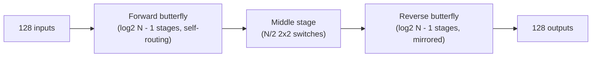
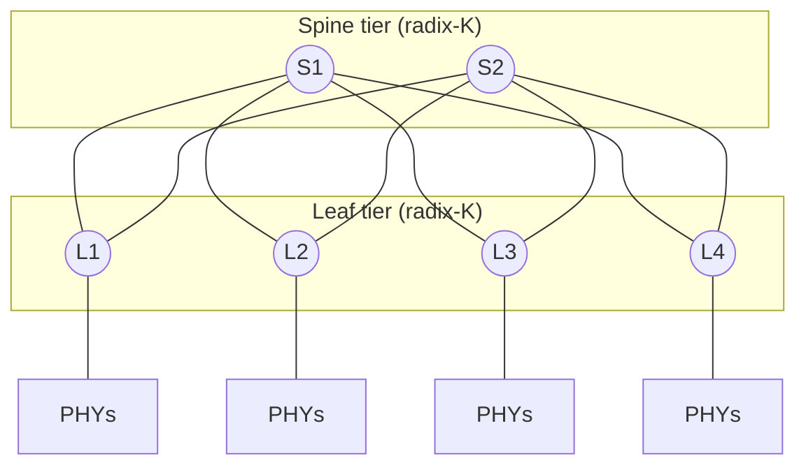
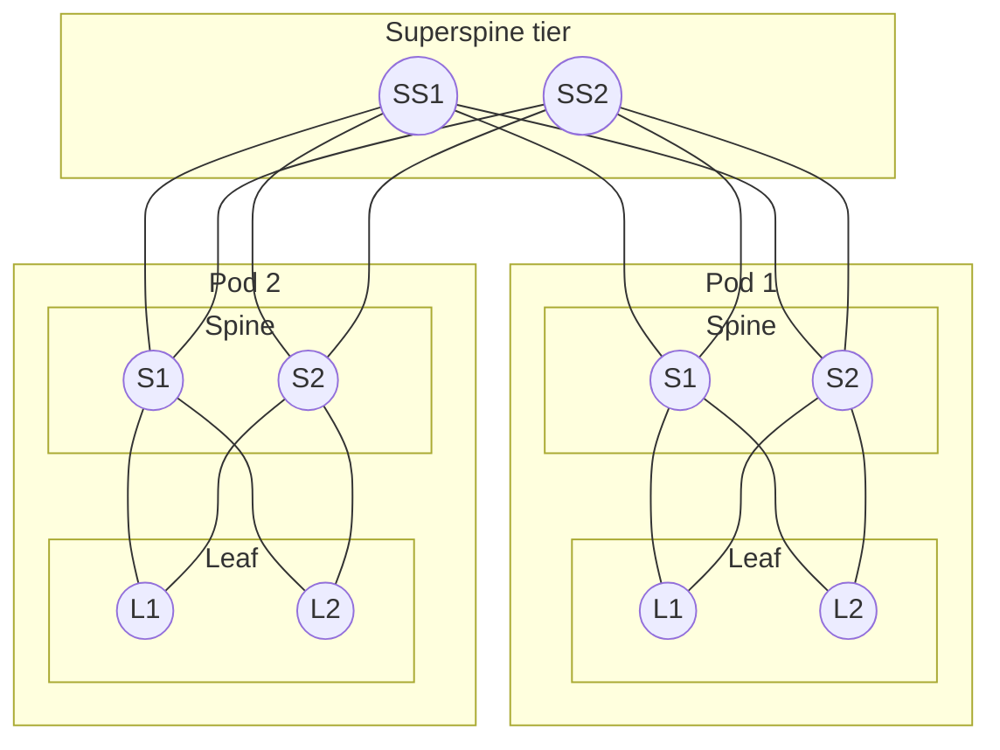

# Crossbar Fabric Architecture Spec

Study/reference doc for the arbitrated crossbar project (interview prep, targeting
AI-networking switch-silicon roles). Covers the candidate interconnection topologies, why
Clos was selected over the alternatives, how the design scales from 128 ports to thousands of
ports, and the resulting design parameters for the project.

Ports are treated as Ethernet PHY/MAC terminations: each ingress MAC receives Ethernet frames,
segments them into fixed-size cells, and hands them to the fabric; each egress MAC reassembles
cells back into frames. Any of the N ports can talk to any other — the fabric doesn't know or
care about frame contents, only cell headers (`{src, dst, seq}`). This framing doesn't change
the topology/scheduling analysis below, but it's why the diagrams label endpoints as PHYs.

---

## 1. Problem statement

Build an input-queued switch fabric that:

1. Avoids head-of-line (HOL) blocking (VOQ).
2. Schedules input-output matches fairly and starvation-free (iSLIP).
3. Scales from N=128 ports today to many thousands of Ethernet PHY ports, without paying
   O(N²) crosspoint cost.
4. Is parameterizable in port count (N), per-tile crossbar radix (K), and Clos tier count (T)
   — so growing the design is a re-parameterization, not a redesign.
5. Reflects real design trade-offs used in production AI-networking switch ASICs, since
   that's the target interview domain (high-radix switch silicon for AI data centers).

The topology choice (how ports are physically interconnected) and the scheduling algorithm
(how contention is resolved each cell time) are separate decisions that interact — this doc
focuses on the topology choice and how it scales.

---

## 2. Candidate topologies

### 2.1 Monolithic crossbar

A single N×N array of crosspoints; every input has a direct physical path to every output.

```
              O0   O1   O2   O3   O4   O5
        I0  [ ●    ●    ●    ●    ●    ● ]
        I1  [ ●    ●    ●    ●    ●    ● ]
        I2  [ ●    ●    ●    ●    ●    ● ]
        I3  [ ●    ●    ●    ●    ●    ● ]
        I4  [ ●    ●    ●    ●    ●    ● ]
        I5  [ ●    ●    ●    ●    ●    ● ]
```
*Shown at N=6 for legibility. Every ● is a dedicated crosspoint. At N=128 this grid is
128×128 = 16,384 crosspoints.*

- **Path diversity**: N/A — every pair has a dedicated crosspoint.
- **Blocking**: none internally (any permutation is physically realizable simultaneously).
- **Cost**: N² crosspoints → **16,384** at N=128.
- **Scheduling**: exactly the single-stage iSLIP problem — one matching decision per cell time.
- **Why it doesn't scale**: quadratic crosspoint growth. Going from 128 to 512 ports is a 16x
  crosspoint increase, not 4x — the textbook reason every high-radix switch ASIC moves to a
  hierarchical fabric once N gets large.

### 2.2 Butterfly / Banyan network

log₂N stages of 2×2 self-routing switch elements. Stage k routes on bit k of the destination
address, so there is **exactly one path** between any given input-output pair.


*N=8 example (3 stages), drawn in the standard textbook form (Leighton; Dally & Towles): a
column of wire positions 0–7 per level, with a straight edge and a crossing edge between every
partner pair at each level — level k pairs positions differing in bit k, so the crossings get
coarser (jump by 4) on the left and finer (jump by 1) on the right. The gray lines are the
network's full switching capability; the four colored lines are 4 of the 8 concrete paths
available from I7, one per output (straight/cross choice at each of the 3 stages selects the
destination — e.g. straight-straight-cross lands on O6, not O7). Any single input can reach
**every** output this way, each via exactly one specific sequence of straight/cross choices —
that per-destination uniqueness (not an absence of reachability) is what makes the network
self-routing, and is exactly why it's internally blocking under arbitrary simultaneous traffic:
two inputs whose unique paths to their destinations need the same wire at the same stage will
collide, and no third routing choice exists to avoid it.*

- **Path diversity**: none — single unique path per pair, by construction.
- **Blocking**: general traffic needs either a **Batcher sorting network** in front
  (Batcher-Banyan) or per-stage buffering with backpressure, accepting statistical (not
  guaranteed) throughput.
- **Cost**: O(N log N) elements → 7 stages × 64 elements = **448 elements** at N=128
  (~1,792 crosspoint-equivalents) — far cheaper than a crossbar or Clos network.
- **Scheduling implication**: the hard problem moves from "matching" to "sorting" or "buffered
  backpressure across stages" — a different discipline from VOQ + iSLIP-style matching.
- **Where VCs fit in**: virtual channels improve queueing efficiency on the one path that
  exists (less HOL blocking at the flow-control layer, no deadlock) but **do not add path
  diversity**. Two flows forced onto the same physical link by an adversarial permutation still
  contend for that link's bandwidth — VCs let them interleave fairly, they don't create a
  second wire. VCs fix the *average case* on a blocking topology; they don't turn it into a
  non-blocking one.
- **Real-world use**: common in NoCs/HPC interconnects (flattened butterfly, Dragonfly)
  precisely because real traffic is rarely adversarial — trading the worst-case guarantee for
  a cheaper topology plus adaptive routing and generous VCs. Riskier for a general AI-fabric
  switch where all-reduce/all-to-all traffic can be adversarial by construction.

### 2.3 Beneš network

Two butterfly/banyan networks placed back-to-back around a shared middle stage — equivalently,
the fully recursive special case of a 3-stage Clos where every module is 2×2
(2·log₂N − 1 stages total).


*Block view at N=128: 13 total stages (2·log₂128 − 1). Structurally this is "give the
butterfly real path diversity" — a second physical pass through switching stages, related to
Valiant load-balancing (disperse to a random midpoint, then route to the true destination).*

- **Path diversity**: yes — genuine, via the second physical pass.
- **Blocking**: rearrangeably non-blocking — any permutation *can* be routed without internal
  contention, but finding the collision-free assignment across the forward/middle/reverse
  stages is a **global** routing/edge-coloring problem, not a local greedy decision.
- **Cost**: O(N log N) elements → 13 stages × 64 elements = **832 elements** at N=128 — much
  cheaper than 3-stage Clos, close to butterfly cost, while still non-blocking.
- **Why not chosen here**: the non-blocking guarantee requires a global batch computation per
  permutation rather than a distributed per-cell-time matching decision — a different
  algorithmic problem from request/grant/accept matching, so it doesn't extend the iSLIP
  skillset this project demonstrates. Right answer if crosspoint economy dominates; wrong
  answer if the point is distributed arbitration.

### 2.4 Clos network (selected)

Three stages of smaller crossbar modules: r input modules (n×m), m middle modules (r×r),
r output modules (m×n).


*Drawn in the classical "bowtie" form (Clos, 1953): input modules on the left, middle modules
in the center, output modules on the right, full bipartite connectivity between adjacent
stages. Shown with 4 input/output modules and 3 middle modules for legibility (full bipartite
connectivity both sides — that bipartite fan-out is the "path diversity" itself). The actual
N=128 design uses 16 input modules (8×8), 8 middle modules (16×16), 16 output modules (8×8) —
same pattern, larger.*

- **Path diversity**: yes — m independent middle-stage modules, each an alternate path between
  any given input and output module.
- **Blocking**: tunable via m.
  - **Rearrangeably non-blocking**: m ≥ n (existing connections may occasionally need
    reassignment to admit a new one).
  - **Strictly non-blocking**: m ≥ 2n − 1 (a new connection never disturbs existing ones —
    Clos/Slepian-Duguid theorem).
- **Cost** (128 ports, rearrangeable, n=8, r=16, m=8): 16×(8×8) + 8×(16×16) + 16×(8×8) =
  **4,096 crosspoints** — ~4x cheaper than monolithic, ~2–9x more than butterfly/Beneš.
- **Scheduling implication**: path diversity becomes an *extra dimension of the same matching
  problem* (which middle module to route a cell through), not a different discipline —
  literally what Concurrent Round-Robin Dispatching (CRRD) and related literature do by
  extending iSLIP's request/grant/accept with a middle-module "path hunting" round. A naive
  per-tile iSLIP does **not** automatically work here — an I/O pair can still see internal
  blocking if the wrong middle module is chosen even with both endpoints idle, which is why
  CRRD-style extensions exist.
- **Industry fit**: folded-Clos (leaf-spine) is the dominant real-world topology for
  hyperscale data-center/AI-cluster scale-out networking, and the standard reason real
  high-radix switch ASICs avoid monolithic crossbars once N gets large (same O(N²) wall as
  §2.1).

---

## 3. Comparison table

| | Monolithic crossbar | Butterfly / Banyan | Beneš | Clos (selected) |
|---|---|---|---|---|
| Paths per I/O pair | N/A (dedicated) | 1 | many (global) | many (local, m-wide) |
| Non-blocking? | Yes, trivially | No (needs sort net or buffering) | Yes, rearrangeable | Yes, tunable (rearrangeable or strict) |
| Crosspoints @ N=128 | 16,384 | ~448 elements (~1,792 equiv.) | ~832 elements | 4,096 |
| Scheduling model | Single-stage matching (iSLIP) | Sorting network, or buffered backpressure | Global routing/edge-coloring | Multi-stage matching (iSLIP + middle-module selection, e.g. CRRD) |
| Fault tolerance | N/A | Single path = single point of failure per pair | Multiple paths, global reroute | Multiple paths, local reroute |
| Extends this project's iSLIP work? | Trivially (same algorithm, bigger N) | No — different discipline | Partially — different algorithm class | Yes — direct, well-documented extension |
| Industry association | Rare at high N | NoCs, HPC interconnects (Dragonfly, flattened butterfly) | Telecom cross-connects, theoretical CS | Hyperscale data-center fabrics (near-universal) |

---

## 4. Decision: Clos

Selected for three reasons, in priority order:

1. **Algorithmic continuity.** The project's point is to demonstrate VOQ + iSLIP arbitration
   depth. Clos's scheduling problem (select a middle module, then match within it) is a
   direct, literature-backed extension of the same request/grant/accept structure (CRRD).
   Butterfly and Beneš both replace matching with a different discipline (sorting/buffering,
   or global routing) that doesn't build on the same skill.
2. **Industry relevance to the target interview.** Eridu's own public language for their
   scale-out design ("single-hop network" up to 5,120 GPUs, "two-tier network" beyond
   1M compute engines) is textbook folded-Clos vocabulary, and the O(N²) crosspoint-scaling
   challenge they describe publicly is precisely the problem Clos decomposition solves. Their
   internal chip microarchitecture is undisclosed — this is an informed inference, not a
   confirmed fact — but Clos is the industry-standard answer at both the layer their marketing
   describes and the layer their technical challenge implies.
3. **Tunable non-blocking guarantee.** Clos lets the cost/guarantee trade-off be an explicit,
   nameable parameter (m relative to n) rather than an implicit property of buffer depth and
   traffic assumptions — easier to defend under questioning than a statistical argument about
   VC-buffered butterfly throughput.

**Explicitly not chosen:**
- *Monolithic crossbar* — kept as Milestone 1/2 reference design to validate correctness
  before adding topology complexity, but not the final target due to O(N²) cost.
- *Butterfly + VCs* — cheaper, but solves a different (weaker, statistical) problem. VCs
  improve queueing efficiency on a fixed path; they don't add path diversity. Reasonable
  under a known-benign traffic model; riskier for general AI-fabric traffic.
- *Beneš* — better crosspoint economy than Clos with an equivalent non-blocking guarantee, but
  its global routing/edge-coloring requirement doesn't extend the per-cell greedy matching
  skillset this project is built around.

---

## 5. Scaling to thousands of ports: do we need more Clos stages?

**Yes, eventually — and the crossover point is a formula, not a guess.**

A 3-stage Clos is limited by the radix it can build its *middle*-stage modules at. If you keep
edge-module size small and let N grow, the middle-stage radix r = N/n grows right along with
it — and once r exceeds the largest crossbar you can actually build as one tile (call that
ceiling **K**, set by area/pinout/wiring and, concretely for this project, by how many
iSLIP iterations you can fit in a cell time at your target clock), the middle stage itself
becomes infeasible as a monolithic crossbar. The fix is the same trick recursively applied:
decompose the middle stage into its own 3-stage Clos, turning a 3-stage network into a
**5-stage** one. This is exactly how real data-center fabrics scale — a 2-tier leaf-spine
network *is* the folded view of a 3-stage Clos; a 3-tier leaf-spine-superspine network *is*
the folded view of a 5-stage Clos.


*2-tier / folded 3-stage Clos — this is your current N=128-radix design, scaled out across
multiple switch tiles instead of built as one.*


*3-tier / folded 5-stage Clos — needed once port count outgrows what a single middle-stage
tile radix can support.*

### The math

For h tiers of radix-K switches (symmetric, half-ports-up/half-ports-down at every
non-terminal tier), maximum supportable ports:

**N_max = 2 × (K/2)^h**

| Tiers (h) | Unfolded Clos stages | N_max at K=64 | N_max at K=128 |
|---|---|---|---|
| 2 (leaf-spine) | 3-stage | 2,048 | **8,192** |
| 3 (leaf-spine-superspine) | 5-stage | 65,536 | 524,288 |
| 4 | 7-stage | 2,097,152 | 33,554,432 |

Using **K=128** — your own project's tile radix, empirically the thing Milestone 2 is
supposed to characterize (max feasible N before iSLIP's log₂N-iteration timing budget breaks
down at your target clock) — a plain **3-stage Clos already reaches 8,192 ports** without
adding a tier. "Many thousands" of ports (low thousands up to ~8K) is covered by the existing
design. Only past ~8K ports would a third tier (5-stage Clos, decomposing the former 128×128
middle-stage crossbars into their own sub-Clos networks) become necessary.

This is also the direct mechanism behind Eridu's own value proposition: doubling native
per-chip radix K roughly *quadruples* the reach of a given tier count (N_max ∝ K^h), which is
exactly why "one high-radix switch replaces up to 30 lower-radix switches, flatter network,
lower latency" is a meaningful claim rather than marketing — bigger K pushes the point where
you need another tier (another hop, more latency, deeper nested scheduling) further out. It
also maps directly onto their own public distinction between a "single-hop network" (their max
native reach at one tier) and a "two-tier network" for anything beyond that.

**Cost of adding a tier**, to be explicit about the trade-off: each additional tier adds a hop
(more latency, more jitter — the exact thing Eridu's flatter-network pitch is optimizing
against) and requires a deeper nested scheduling extension (a 5-stage Clos needs CRRD-style
matching with *two* levels of "which module" selection, not one). Tiers should be added only
when the N_max formula says the current tier count can't reach the target port count — not
preemptively.

---

## 6. Resulting design parameters

- **N** — total port count (Ethernet PHYs), the top-level parameter.
- **K** — max feasible single-tile crossbar radix, determined empirically in Milestone 2
  (bounded by iSLIP's log₂(tile-N)-iteration timing budget at target clock).
- **T** — Clos tier count, chosen from the N_max = 2×(K/2)^T formula in §5 for the target N.
- Cell size: fixed, e.g. 64B (TBD — decide alongside VOQ depth sizing).
- Milestone 1: 8×8 monolithic crossbar, VOQ + iSLIP, reference/golden-model validated.
- Milestone 2: scale reference design to N=128 monolithic; characterize O(N) arbiter cost,
  iterations-vs-throughput curve, and the practical K ceiling for a single tile.
- Milestone 3: 3-stage Clos at N=128 (T=2 tiers, n=8, r=16, m=8 → 4,096 crosspoints),
  CRRD-style scheduling extension of the Milestone 1/2 `rr_pointer` primitive.
- Stretch: generalize the Milestone 3 Clos generator to be recursive in T (parameterized
  tier count), so scaling from 128 to thousands of ports is "increase T per the §5 formula"
  rather than a redesign.

---

## 7. Interview talking points checklist

- [ ] HOL blocking and why VOQ fixes it (and what VOQ alone doesn't fix — still needs
      speedup or careful scheduling for 100% throughput under non-uniform traffic).
- [ ] iSLIP mechanism: request/grant/accept, rotating priority pointers, desynchronization,
      why pointers only update on a successful match.
- [ ] iSLIP performance: ~63% single-iteration asymptotic throughput under uniform traffic;
      O(log N) iterations needed to converge toward a maximal (not maximum) matching.
- [ ] Clos non-blocking conditions: rearrangeable (m≥n) vs strict-sense (m≥2n−1), and the
      operational difference (occasional path reassignment vs never).
- [ ] Why a naive per-tile iSLIP doesn't just work on a multi-stage Clos, and what CRRD adds.
- [ ] Butterfly/Banyan blocking behavior and why VCs don't fix it (flow-control fix vs
      topological fix — different problems).
- [ ] Beneš as the "give a butterfly real path diversity" structure, and why its global
      routing requirement makes it a worse fit here than Clos despite better crosspoint cost.
- [ ] Crosspoint-count math for all four topologies at N=128 (table in §3).
- [ ] N_max = 2×(K/2)^h formula for h-tier Clos/fat-tree networks, and being able to derive
      it live (each non-terminal tier splits radix K half up / half down).
- [ ] Connection to Eridu's own public framing: O(N²) crossbar scaling wall at high radix,
      "single-hop"/"two-tier" scale-out language as folded-Clos terminology, and why bigger
      native chip radix (K) directly reduces required tiers for a given port count.
